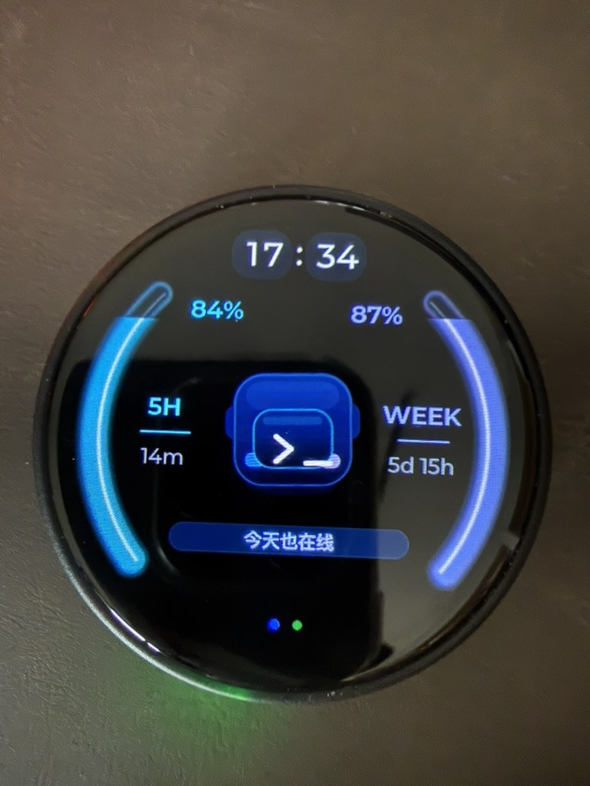

# M5stopwatch-vibecoding

M5Stack StopWatch 的 Codex vibe-coding 模块、扩展固件和 macOS 桥接应用。



本项目是在 M5Stack StopWatch 原演示固件 / UserDemo 的基础上继续开发出来的 Codex vibe-coding 模块。它不是替代原厂基础工程，而是在原有 StopWatch 圆屏、按键、IMU、BLE、音频、LVGL 应用框架之上，新增 Codex 状态页、Pet 形象、额度展示、macOS 输入桥接和省电策略。

这个扩展把 M5Stack StopWatch 做成一个小型桌面状态设备：圆屏显示 Codex 额度、宠物状态、蓝牙和电量；实体按键可以绑定到 macOS 输入工具；macOS 桥接应用负责读取本机状态、同步按键配置，并把安全裁剪后的额度数据发到设备。

## 为什么适合 vibe coding

Vibe coding 的输入瓶颈通常不在代码编辑器，而在“把想法连续、低摩擦地说出来”。长提示词、需求拆解、错误复盘、方案对比和上下文补充都更适合语音输入；如果每次都要切窗口、找快捷键或确认输入法状态，思路很容易被打断。

M5Stack StopWatch 的形态很适合作为 vibe-coding 语音输入遥控器：

- 实体 A/B 键尺寸明确，盲按比键盘组合键更稳定，适合一边看 Codex / IDE，一边启动或结束语音输入。
- 圆形 AMOLED 屏可以常驻显示“正在录制 / 处理中 / 已空闲”、Codex 额度、电量和连接状态，不需要把注意力切回输入法窗口。
- 设备通过 BLE HID 直接发真实按键；macOS App 只同步状态和配置，不注入文字或模拟复杂焦点操作，因此更适合长时间编码时保持输入链路稳定。
- 支持 Typeless 和微信输入法两种语音输入路径：用户可以在 App 里切换模式，设备按键绑定会同步到固件，脱离 App 时也能保留基础按键触发。
- Shake 清除输入适合语音识别出错后的快速重来，减少从思考状态切回鼠标键盘操作的次数。

这个项目的目标不是替代语音输入法，而是给 Codex / ChatGPT / Claude Code / IDE 这类 vibe-coding 工作流加一个专用的“物理语音控制层”：让开始说、停止说、确认发送、清空重说这些动作从桌面操作里独立出来。

## 基础来源

- 基础固件：M5Stack StopWatch 原演示固件 / UserDemo。
- 扩展模块：本仓库新增的 Codex vibe-coding 页面、Pet 动画、BLE Bridge 配置协议、macOS Bridge、Typeless/微信输入法按键绑定、省电和状态栏逻辑。
- 保留能力：原固件中的圆屏显示、按键、IMU、BLE、音频、LVGL 应用组织和部分示例应用。

如果你已经熟悉原 M5Stack StopWatch demo，可以把本项目理解为“在原 demo 固件里新增一个 Codex 桌面 companion 应用，并配套一个 macOS 菜单栏桥接端”。

## 目录

```text
firmware-stopwatch-idf/   ESP-IDF 固件
tools/typeless_bridge/    macOS 菜单栏桥接应用
docs/                     功能说明、额度机制、宠物替换指南
```

## 核心功能

- Codex 页面：显示 5 小时额度、周额度、时间、电量、BLE 状态和宠物动画。
- macOS Bridge：连接 `M5Codex-*` BLE 设备，推送 Codex 额度，切换输入模式，配置 A/B/摇晃动作。
- 输入模式：支持 Typeless 和微信输入法两套语音输入模式；按键绑定会保存到 macOS app，并同步到固件 NVS，真实按键由设备 BLE HID 发出。
- Typeless 状态：macOS Bridge 可通过 Accessibility 观察录音/处理中状态，并把状态同步到设备；输入触发仍由设备负责。
- 电量状态栏：Codex 页面顶部下拉显示电量；20% 以下红色常驻，也可以手动上滑隐藏。
- Pet：基于多帧 C 资产的 LVGL 图片动画，可替换为自己的形象。
- 省电：1 分钟降亮度和降频，3 分钟关闭屏幕/LVGL 更新，10 分钟 deep sleep；Wi-Fi 默认关闭，额度优先由 macOS BLE 推送。

完整功能说明见 [docs/FEATURES.md](docs/FEATURES.md)。
省电策略见 [docs/POWER_SAVING.md](docs/POWER_SAVING.md)。

## 构建固件

需要 ESP-IDF v5.5.x 和 M5Stack StopWatch 目标硬件。

```bash
cd firmware-stopwatch-idf
idf.py set-target esp32s3
idf.py build
idf.py app-flash
```

公开版默认不包含私人 Wi-Fi 和私人 relay。远端 panel URL 在：

```text
firmware-stopwatch-idf/main/apps/app_codex/codex_config.h
```

如果只使用 macOS Bridge 的 BLE 额度推送，可以保持 Wi-Fi 关闭。

## 构建 macOS Bridge

```bash
tools/typeless_bridge/build_stopwatch_ble_bridge.sh
tools/typeless_bridge/install_launch_agent.sh
```

安装后在系统设置里给 `StopWatch BLE Bridge` 开启：

```text
Privacy & Security -> Accessibility
```

LaunchAgent 默认 `RunAtLoad=true`、`KeepAlive=false`：开机自动启动，但用户退出后不会被强制拉起。

## 额度机制

Codex 额度由 macOS 本机读取，不写入固件，也不要求用户粘贴 token。Bridge 在用户开启额度推送时读取本机 Codex 登录文件，调用 ChatGPT/Codex 的本机已登录接口，得到 5 小时和周额度后通过 BLE 写入设备。

Claude Code 额度不在固件里直接实现。建议参考 `ai-limit` 这类 macOS 开源额度监控工具的做法：在 Mac 侧读取本机登录/使用状态，生成安全摘要，再通过 Bridge 或本地服务推送给设备。详细说明见 [docs/QUOTA.md](docs/QUOTA.md)。

## 隐私边界

- 固件不保存 OpenAI、Claude、Typeless、微信输入法或任何云服务 token。
- 固件不读取浏览器 Cookie、Keychain 或 `~/.codex`。
- macOS Bridge 只在本机读取本机登录状态，并只向设备发送额度百分比、剩余时间和状态字段。
- 公开版已移除私人 Wi-Fi、私人域名、内部 server、历史 handoff 和构建产物。

## License

See [LICENSE](LICENSE). Third-party components under `firmware-stopwatch-idf/components/` keep their original licenses.
