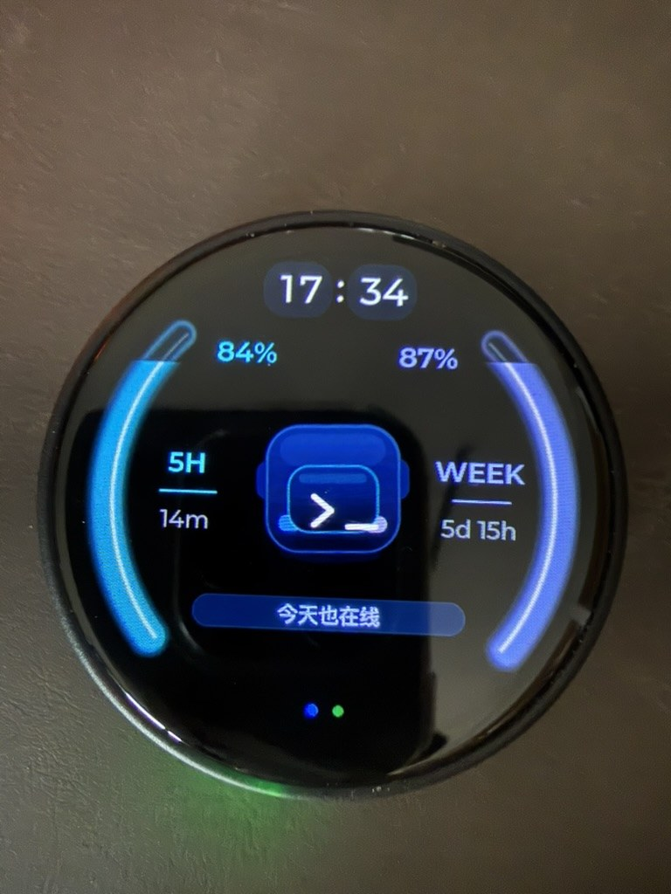

# M5stopwatch-vibecoding


把 M5Stack StopWatch 变成 Codex、ChatGPT、Claude Code 和 IDE 的桌面状态屏与语音输入控制器。配套 macOS 菜单栏 App 可以把手表麦克风实时接入 Mac，并提供系统可用的 `M5 StopWatch Mic` 输入设备。

当前固件版本是 **v0.7.0**（2026-08-16），配套 macOS Bridge 版本为 **v1.1.2**。查看[固件更新记录](CHANGELOG.md)、[Bridge 更新记录](tools/typeless_bridge/CHANGELOG.md)和[最新下载](https://github.com/liptoxli/M5stopwatch-vibecoding/releases/latest)。



圆形 AMOLED 屏可以显示 Codex 周额度、宠物状态、蓝牙连接和电量；实体 A/B 键可以控制语音输入与发送；macOS Bridge 负责蓝牙连接、按键配置、额度同步和虚拟麦克风。

## 为什么适合 vibe coding

Vibe coding 的输入瓶颈通常不在代码编辑器，而在“把想法连续、低摩擦地说出来”。长提示词、需求拆解、错误复盘、方案对比和上下文补充都更适合语音输入；如果每次都要切窗口、找快捷键或确认输入法状态，思路很容易被打断。

M5Stack StopWatch 的形态很适合作为 vibe-coding 语音输入遥控器：

- 实体 A/B 键尺寸明确，盲按比键盘组合键更稳定，适合一边看 Codex / IDE，一边启动或结束语音输入。
- 圆形 AMOLED 屏可以常驻显示“正在录制 / 处理中 / 已空闲”、Codex 额度、电量和连接状态，不需要把注意力切回输入法窗口。
- 设备通过 BLE HID 直接发真实按键；macOS App 只同步状态和配置，不注入文字或模拟复杂焦点操作，因此更适合长时间编码时保持输入链路稳定。
- 支持 Typeless 和微信输入法两种语音输入路径：用户可以在 App 里切换模式，设备按键绑定会同步到固件，脱离 App 时也能保留基础按键触发。
- Shake 清除输入适合语音识别出错后的快速重来，减少从思考状态切回鼠标键盘操作的次数。

这个项目的目标不是替代语音输入法，而是给 Codex / ChatGPT / Claude Code / IDE 这类 vibe-coding 工作流加一个专用的“物理语音控制层”：让开始说、停止说、确认发送、清空重说这些动作从桌面操作里独立出来。

## 目录

```text
firmware-stopwatch-idf/   ESP-IDF 固件
tools/typeless_bridge/    macOS 菜单栏桥接应用
docs/                     功能说明、额度机制、宠物替换指南
```

## 核心功能

- Codex 页面：只显示周额度、08:00 后今日消耗、重置倒计时、时间、连接状态和宠物动画。
- macOS Bridge：连接 `M5Codex-*` BLE 设备，推送 Codex 额度，切换输入模式，配置 A/B/摇晃动作。
- 虚拟麦克风：菜单一键开启 `M5 StopWatch Mic`，StopWatch 以 16 kHz IMA-ADPCM 实时传输，Mac Bridge 解码后供 Typeless 等应用作为默认输入。
- 输入模式：支持 Typeless 和微信输入法两套语音输入模式；按键绑定会保存到 macOS app，并同步到固件 NVS，真实按键由设备 BLE HID 发出。
- Typeless 状态：macOS Bridge 可通过 Accessibility 观察录音/处理中状态，并把状态同步到设备；输入触发仍由设备负责。
- 电量状态栏：Codex 页面顶部下拉显示电量；20% 以下红色常驻，也可以手动上滑隐藏。
- Pet：基于多帧 C 资产的 LVGL 图片动画，可替换为自己的形象。
- 省电：1 分钟降亮度和降频，3 分钟关闭显示并进入 activity sleep，15 分钟且未接外部电源时由 PMIC 自动关机；Wi-Fi 默认关闭，额度优先由 macOS BLE 推送。
- 供电策略：插着 USB 时不自动关机；activity sleep 不是重启，可以通过触摸、按键或移动恢复。

完整功能说明见 [docs/FEATURES.md](docs/FEATURES.md)。
省电策略见 [docs/POWER_SAVING.md](docs/POWER_SAVING.md)。
周额度圆屏几何见 [docs/WEEKLY_SEMICIRCLE_UI.md](docs/WEEKLY_SEMICIRCLE_UI.md)。

## 版本历史

| 日期 | 固件 | Mac Bridge | 主要更新 |
| --- | --- | --- | --- |
| 2026-08-16 | v0.7.0 | v1.1.2 | 虚拟麦音频引擎心跳、静音检测与局部自动恢复 |
| 2026-08-16 | v0.7.0 | v1.1.1 | 实时 BLE 麦克风、`M5 StopWatch Mic` 驱动和断线自动恢复 |
| 2026-08-15 | v0.6.0 | v1.0.3 | 周额度/08:00 日基线、输入配置和 Bridge 稳定性改进 |
| 2026-06-13 | v0.5.0（界面 V0.5） | v1.0.0-v1.0.2 | Codex 页面、Pet、BLE Bridge、Typeless/微信输入模式和 BLE HID |

每个版本的逐项变更分别记录在固件 [CHANGELOG](CHANGELOG.md) 和 Mac Bridge [CHANGELOG](tools/typeless_bridge/CHANGELOG.md)。

## 构建固件

需要 ESP-IDF v5.5.x 和 M5Stack StopWatch 目标硬件。

仓库根目录的 `VERSION` 和 `firmware-stopwatch-idf/version.txt` 是当前版本标识，构建前可运行 `tools/check_version.sh` 检查版本是否一致。

```bash
cd firmware-stopwatch-idf
idf.py set-target esp32s3
idf.py build
idf.py flash
```

首次安装、从 v0.6.0 或更早版本升级，或 `partitions.csv`/Bootloader 发生变化时，必须使用完整 `idf.py flash`。仅在设备已经使用当前分区布局、只是更新同一兼容版本的应用时，才使用 `idf.py app-flash`；否则旧分区表可能从错误地址启动并表现为黑屏。

Wi-Fi 和远端 panel 默认关闭。如需启用，可在这里填写自己的 panel URL 和 Wi-Fi 信息：

```text
firmware-stopwatch-idf/main/apps/app_codex/codex_config.h
```

如果只使用 macOS Bridge 的 BLE 额度推送，可以保持 Wi-Fi 关闭。

## 构建 macOS Bridge

```bash
tools/typeless_bridge/build_stopwatch_ble_bridge.sh
tools/typeless_bridge/install_launch_agent.sh
```

安装后在系统设置里给 `StopWatch BLE Bridge` 开启：

```text
Privacy & Security -> Accessibility
```

LaunchAgent 默认 `RunAtLoad=true`、`KeepAlive=false`：开机自动启动，但用户退出后不会被强制拉起。

虚拟麦克风模式默认关闭。开启后连续实时传输，不生成 WAV 文件；关闭后恢复原 macOS 默认输入。协议、带宽和包结构见 [docs/stopwatch-ble-microphone.md](docs/stopwatch-ble-microphone.md)。Core Audio 驱动的许可证说明见 [THIRD_PARTY_NOTICES.md](THIRD_PARTY_NOTICES.md)。

产品安装包会安装菜单栏 App、登录 LaunchAgent 和 `M5 StopWatch Mic` 驱动。如果 Mac 中仍有 `BlackHole 2ch`，确认新麦克风正常后可以单独卸载。

## 额度机制

Codex 额度由 macOS 本机读取，不要求用户粘贴 token。Bridge 在用户开启额度推送时读取本机 Codex 登录文件，调用 ChatGPT/Codex 的本机已登录接口，只提取 604800 秒周窗口，并把安全摘要通过 BLE 写入设备。固件只缓存额度摘要，不接收登录凭据。

Bridge 以本地时间每天 08:00 为日统计边界，累计本周期内周额度下降的百分点。Bridge 如果在 08:00 没运行，只能从边界后的第一次成功采样开始，不能回溯精确历史。

Claude Code 额度不在固件里直接实现。建议参考 `ai-limit` 这类 macOS 开源额度监控工具的做法：在 Mac 侧读取本机登录/使用状态，生成安全摘要，再通过 Bridge 或本地服务推送给设备。详细说明见 [docs/QUOTA.md](docs/QUOTA.md)。

## 隐私与安全

- 固件不保存 OpenAI、Claude、Typeless、微信输入法或任何云服务 token。
- 固件不读取浏览器 Cookie、Keychain 或 `~/.codex`。
- macOS Bridge 只在本机读取本机登录状态，并只向设备发送额度百分比、剩余时间和状态字段。

## 致谢

固件基于 M5Stack StopWatch UserDemo，第三方组件保留各自许可证。

## License

See [LICENSE](LICENSE). Third-party components under `firmware-stopwatch-idf/components/` keep their original licenses.
