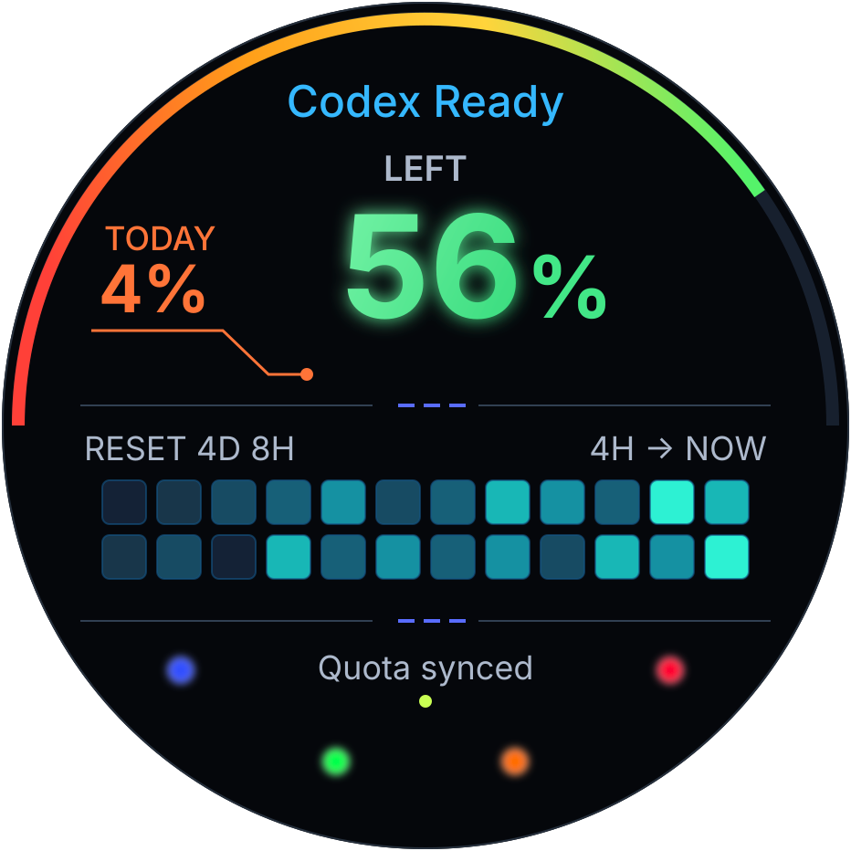

# M5 StopWatch for Vibe Coding

<p align="center">
  <strong>把 M5Stack StopWatch 变成桌面上的 Codex 状态屏、语音输入控制器和实时蓝牙麦克风。</strong>
</p>

<p align="center">
  
  
  
  
</p>

<p align="center">
  
</p>

M5 StopWatch for Vibe Coding 为 Codex、ChatGPT、Claude Code 和 IDE 工作流增加了一层独立的物理交互：按下实体键开始讲话，StopWatch 麦克风通过 BLE 实时传到 Mac，再由系统输入设备 `M5 StopWatch Mic` 交给 Typeless 等语音输入应用。屏幕同时显示 Codex 周额度、当天用量、最近四小时的使用强度、未读任务和连接状态。

它不是录音机，也不会先生成 WAV 文件。语音以 16 kHz IMA-ADPCM 实时流传输，停止讲话后即可进入识别和发送流程。

## 项目现状

当前版本为 **固件 v0.9.0 / macOS Bridge v1.2.0**，核心链路已经在真实设备上完成日常使用验证。

| 能力 | 当前状态 |
| --- | --- |
| StopWatch 麦克风 → BLE → Mac 虚拟麦克风 → Typeless | 已完成，支持实时语音输入 |
| A/B 实体键、长按、摇晃操作 | 已完成，按键由设备通过 BLE HID 直接发送 |
| Codex 周额度、当天消耗和重置倒计时 | 已完成，由 Mac Bridge 本地读取并推送摘要 |
| Codex 未读任务提醒 | 已完成，标题和颜色随未读数量变化 |
| 最近四小时使用强度 | 已完成，24 格滚动窗口，每格 10 分钟 |
| Classic / Pet 与 OpenWatcher V2 两套 UI | 已完成，可在设备中切换 |
| 断线与音频异常处理 | 已完成，异常时结束本次听写并提示重新录制 |
| 省电、息屏和自动关机 | 已完成，日常混合使用约为 5 小时级 |

当前版本适合实机体验、二次开发和日常语音输入。电量百分比仍以电池电压估算，低电量区会偏保守；因此页面中的续航数字是实测范围，不是实验室标称值。

## 两套界面

<table>
  <tr>
    <th width="50%">Classic / Pet</th>
    <th width="50%">OpenWatcher V2</th>
  </tr>
  <tr>
    <td align="center"></td>
    <td align="center"></td>
  </tr>
  <tr>
    <td>延续项目最早的桌面伙伴方向，以时间、额度弧线、Pet 动画和轻量状态反馈为核心。适合喜欢角色感和动态反馈的用户。</td>
    <td>当前重点优化的效率界面。信息层级更直接，强调剩余额度、当天消耗、四小时活动热力图和未读任务状态。</td>
  </tr>
</table>

### OpenWatcher V2 的设计重点

- 顶部半圆进度条使用具有语义的渐变色：剩余额度越充足越接近绿色，额度紧张时逐步转为黄色、橙色和红色。
- 中央只突出“剩余百分比”，左侧单独显示当天已使用量，避免“已用”和“剩余”同时占据视觉中心。
- 24 个方格覆盖最近四小时，每格代表 10 分钟；颜色深浅由实际录音时长和启动频率共同决定。
- 标题同时承担 Codex 通知作用：无未读为蓝色，1 个为黄色、2 个为橙色、3 个及以上为红色。
- 静态区域按变化更新，录音波形限制刷新频率，兼顾实体按键响应、界面流畅度和功耗。

## 为什么适合语音驱动的 Coding 工作流

- **不用切窗口**：盲按实体键即可开始或结束语音输入，思路不需要停下来找快捷键。
- **状态在桌面上可见**：录音、处理中、断线、额度和未读任务都由圆屏即时反馈。
- **是真正的系统麦克风**：Mac 端看到的是 `M5 StopWatch Mic` 输入设备，Typeless 等应用可以直接使用。
- **链路简单可控**：设备负责真实 BLE HID 按键，Mac Bridge 负责音频、状态和额度同步。
- **异常不会静默拼接**：录音中断后会结束本次听写并提示重说，避免把缺失中段的语音继续发送。

## 续航

当前省电策略包括 CPU 动态降频、麦克风按需启动、差分刷新、1 分钟降亮度、3 分钟息屏以及无外接电源时的 15 分钟自动关机。

2026-08-17 至 2026-08-18 的一次真实混合使用测试中：

- 累计实际开机时间为 **4 小时 33 分 55 秒**，关机时段已剔除。
- 从首次可靠的 86% 电量记录到插入 USB 为 **4 小时 20 分 51 秒**。
- 最后阶段包含屏幕常亮和频繁语音输入，属于偏重度使用。
- 按相同负载粗略估算，完整电量约为 **5 小时级**。
- 表显 0% 后设备仍继续运行至少 2 分 56 秒，说明低电量百分比仍需进一步校准。

详细测试边界和每段记录见 [续航测试记录](docs/BATTERY_TEST.md)，省电机制见 [省电与降温策略](docs/POWER_SAVING.md)。

## 使用方式

1. 将固件刷入 M5Stack StopWatch。
2. 在 macOS 蓝牙设置中配对名称为 `M5Codex-*` 的设备。
3. 安装并启动 StopWatch BLE Bridge，允许辅助功能权限。
4. 在菜单栏打开 `M5 StopWatch Mic`，并在语音输入应用中选择这个麦克风。
5. 使用 A 键控制语音输入，使用 B 键确认或发送；具体键位可在 Bridge 中配置。

Bridge 支持 Typeless 和微信输入法两种输入路径，也可以配合任何接受普通键盘快捷键和系统麦克风的应用使用。

## 功能概览

- 16 kHz、20 ms 分帧、4-bit IMA-ADPCM 的实时 BLE 音频。
- macOS 菜单栏 Bridge 与 `M5 StopWatch Mic` Core Audio 输入设备。
- BLE HID 实体按键、长按确认和摇晃清除。
- Codex 周额度、当天使用量、重置倒计时和未读任务状态。
- 最近四小时的设备使用强度热力图。
- Typeless 录音、处理、空闲和异常状态反馈。
- BLE 自动重连、音频输出自恢复和明确的录音中断提示。
- Wi-Fi 默认关闭；Codex 数据优先通过低功耗 BLE 同步。

完整说明可继续阅读：

- [功能说明](docs/FEATURES.md)
- [BLE 麦克风协议](docs/stopwatch-ble-microphone.md)
- [Codex 额度机制](docs/QUOTA.md)
- [隐私与安全](docs/SECURITY_AND_PRIVACY.md)
- [Pet 自定义](docs/PET_CUSTOMIZATION.md)

## 版本历史

| 日期 | 固件 | Mac Bridge | 主要更新 |
| --- | --- | --- | --- |
| 2026-08-18 | v0.9.0 | v1.2.0 | Codex 未读任务标题、滚动四小时活动热力图、续航实测与新版项目首页 |
| 2026-08-17 | v0.8.1 | v1.1.8 | 修复省电版本中的 BLE ATT 超时和反复断线，串行化 Bridge 写入并补齐进程守护 |
| 2026-08-16 | v0.8.0 | v1.1.7 | 整机省电与降温，将活动窗口调整为最近四小时 |
| 2026-08-16 | v0.7.4 | v1.1.6 | 录音断线明确报错并结束本次听写，重连后重新录制 |
| 2026-08-16 | v0.7.3 | v1.1.5 | 麦克风改为按需传输，设备键和 Mac 快捷键都可唤醒 |
| 2026-08-16 | v0.7.2 | v1.1.4 | OpenWatcher V2 差分刷新和 10 FPS 波形 |
| 2026-08-16 | v0.7.1 | v1.1.3 | 修复 OpenWatcher V2 的按键响应和再次录音 |
| 2026-08-16 | v0.7.0 | v1.1.2 | 实时 BLE 麦克风、虚拟输入和音频自恢复 |
| 2026-08-15 | v0.6.0 | v1.0.3 | 周额度、输入配置和 Bridge 稳定性改进 |
| 2026-06-13 | v0.5.0 | v1.0.0–v1.0.2 | 首个 Codex 页面、Pet、BLE Bridge 和输入模式 |

逐项变更记录见 [固件 Changelog](CHANGELOG.md) 和 [Bridge Changelog](tools/typeless_bridge/CHANGELOG.md)。

<details>
<summary><strong>从源码构建</strong></summary>

### 固件

需要 ESP-IDF v5.5.x 和 M5Stack StopWatch：

```bash
cd firmware-stopwatch-idf
idf.py set-target esp32s3
idf.py build
idf.py flash
```

首次安装或分区表发生变化时使用完整 `idf.py flash`；确认分区布局兼容后才使用 `idf.py app-flash`。

### macOS Bridge

```bash
tools/typeless_bridge/build_stopwatch_ble_bridge.sh
tools/typeless_bridge/install_launch_agent.sh
```

安装后在 `系统设置 → 隐私与安全性 → 辅助功能` 中允许 `StopWatch BLE Bridge`。

</details>

## 隐私

- 固件不保存 OpenAI、Typeless、微信输入法或其他云服务凭据。
- Mac Bridge 只在本机读取当前用户的 Codex 状态，并向设备发送额度、剩余时间、未读数量和运行状态摘要。
- 麦克风音频只在本机通过 BLE 实时传给虚拟输入设备；本项目不生成 WAV 文件，也不提供云端录音服务。

## 开源许可

本项目的原创代码和修改内容使用 [MIT License](LICENSE)。固件所包含的第三方组件继续遵循各自许可证。

`M5 StopWatch Mic` 使用基于 BlackHole 的独立 Core Audio 驱动，该组件遵循 GPLv3；来源、固定提交和再分发要求见 [THIRD_PARTY_NOTICES.md](THIRD_PARTY_NOTICES.md)。

## 致谢

项目基于 M5Stack StopWatch UserDemo，并使用 ESP-IDF、LVGL、BlackHole 等开源项目。感谢所有上游项目和贡献者。
